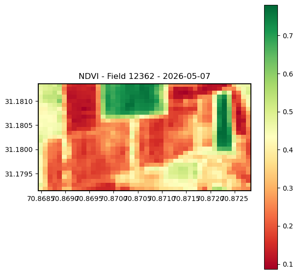
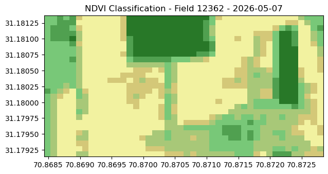
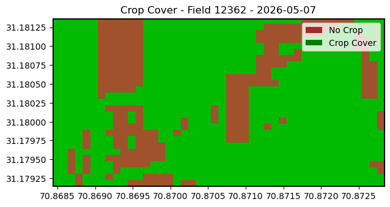

# NDVI Field Analysis Pipeline

Automated satellite imagery pipeline that accepts field polygon 
coordinates, retrieves clean Sentinel-2 imagery using field-level 
cloud scoring, computes NDVI statistics, stores per-pixel data to 
a database, and generates vegetation maps on demand.

Built for production use at a precision agriculture startup in Pakistan.

---

## Pipeline Phases

### Phase 2 — Field NDVI with Cloud Filtering
`src/phase2/ndvi_pipeline.py`

- Accepts any number of polygon coordinates as input
- Searches Sentinel-2 archive oldest to newest from a given start date
- Scores cloud cover at field level using Google Cloud Score Plus
- Returns first clean image where field cloud probability is below 25%
- Computes NDVI min / max / mean across the field
- Classifies pixels into 10 vegetation categories with real hectare areas
- Outputs crop cover percentage
- Prints result to stdout for PHP integration
- Saves 3 georeferenced PNG maps automatically

### Phase 3 — Pixel Storage and On-Demand PNG Generation
`src/phase3/data_collector.py`
`src/phase3/png_generator.py`

Major architectural upgrade over Phase 2:

- Every pixel saved to database with its real-world latitude and longitude
- NDVI class assigned per pixel at storage time
- Summary statistics stored in separate results table
- PNG generation removed from automatic pipeline
- New on-demand PNG generator reads directly from pixel database
- No satellite call needed for PNG generation
- Duplicate prevention via UNIQUE KEY constraints

Why pixel-level storage matters:

1. Tree pixel identification — pixels that stay consistently above
   0.6 NDVI across seasons can be flagged as permanent vegetation
   and excluded from crop calculations improving accuracy

2. Time series per pixel — each pixel builds its own NDVI history
   over time enabling crop growth stage detection and yield prediction

3. ML and deep learning ready — pixel data with lat/lng coordinates
   and class labels is the exact format needed for training crop
   classification and disease detection models

---

## How Cloud Filtering Works

Each candidate image is scored at two levels:

- Tile level — CLOUDY_PIXEL_PERCENTAGE from Sentinel-2 metadata
  covers the entire 100km x 100km satellite tile
- Field level — Google Cloud Score Plus cs_cdf band averaged over
  the exact polygon area only

Only images with field-level cloud probability below 25% are accepted.

This prevents cases where a tile appears mostly clear but the specific
field polygon is under cloud cover — a critical distinction for small
agricultural fields in Pakistan.

---

## Database Schema

See `database/schema.sql` for complete table definitions.

Two tables:

**ndvi_pixels** — one row per pixel per field per date
field_id, image_date, pixel_row, pixel_col,

latitude, longitude, ndvi_value, cloud_prob, ndvi_class

**ndvi_results** — one row per field per date summary
field_id, image_date, ndvi_min, ndvi_max, ndvi_mean,

cloud_prob, total_pixels, valid_pixels, crop_cover_pct, status

---

## Setup

### 1. Clone the repo
git clone https://github.com/starfiee/ndvi-pipeline.git

cd ndvi-pipeline

### 2. Install dependencies
pip install -r requirements.txt

### 3. Authenticate Google Earth Engine
earthengine authenticate

### 4. Set your GEE project ID
cp .env.example .env
Edit `.env` and add your GEE project ID.

### 5. Set up database
Import `database/schema.sql` into your MySQL database.

---

## How To Run

### Phase 2 — Collect NDVI for one field
python src/phase2/ndvi_pipeline.py 14 

31.181412 31.181004 31.180714 31.180635 

31.180370 31.180285 31.180252 31.179164 

31.179100 31.179600 31.179972 31.179927 

31.180291 31.180273 

70.872642 70.871164 70.871153 70.869695 

70.869708 70.868820 70.868386 70.868454 

70.869017 70.871185 70.871865 70.872600 

70.872497 70.872891 

12362 2026-05-06

### Phase 3 — Collect and store pixel data
python src/phase3/data_collector.py 14 

31.181412 31.181004 31.180714 31.180635 

31.180370 31.180285 31.180252 31.179164 

31.179100 31.179600 31.179972 31.179927 

31.180291 31.180273 

70.872642 70.871164 70.871153 70.869695 

70.869708 70.868820 70.868386 70.868454 

70.869017 70.871185 70.871865 70.872600 

70.872497 70.872891 

12362 2026-05-06

### Phase 3 — Generate PNG on demand
All 3 maps
python src/phase3/png_generator.py 12362 2026-05-07 all
NDVI map only
python src/phase3/png_generator.py 12362 2026-05-07 ndvi
Crop cover only
python src/phase3/png_generator.py 12362 2026-05-07 cropcover

---

## Sample Output

| NDVI Map | Vegetation Classes | Crop Cover |
|----------|-------------------|------------|
|  |  |  |

---

## Output Format
Sawie-ndvi-parameters

0.0868 0.7801 0.3396

[{"class":"Water","area_ha":2.9552},{"class":"Builtup Area","area_ha":3.7483},...]

Sawie-crop-cover

77.1

image_date:2026-05-07

cloud_prob:0.1433

status:clean

created_at:2026-06-15 09:54:18

---

## Repository Structure
ndvi-pipeline/

├── src/

│   ├── phase2/

│   │   └── ndvi_pipeline.py      # Field NDVI with cloud filtering

│   └── phase3/

│       ├── data_collector.py     # Pixel storage to database

│       └── png_generator.py      # On-demand PNG generation

├── database/

│   └── schema.sql                # MySQL table definitions

├── demo/

│   └── sample_output/            # Sample PNG outputs

├── docs/

│   └── how_it_works.md

├── .env.example

├── requirements.txt

└── README.md

---

## Tech Stack

Python · Google Earth Engine · Sentinel-2 L2A ·
GeoPandas · Shapely · Rasterio · NumPy ·
Matplotlib · MySQL · mysql-connector-python

---

## What Is Coming Next

- Phase 4 — Tree pixel detection and exclusion from crop statistics
- Cron job for automated multi-field data collection
- ML-ready pixel time series export per field